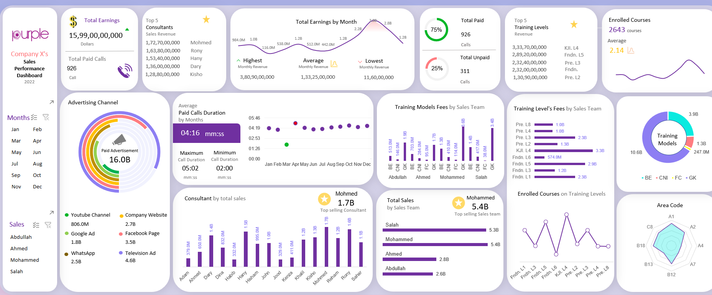

# 📊 Sales Performance Dashboard (Excel)

This project is a fully interactive **Sales Performance Dashboard** designed in Microsoft Excel.  
It transforms raw sales data into clear, insightful visuals that help analyze revenue, consultant contributions, advertising impact, call patterns, and training-level performance.  
The dashboard follows a modern, card-style UI theme with clean charts, bold KPIs, and intuitive filtering.

---

## 🔧 Excel Features & Tools Used
This dashboard was built using a combination of advanced and design-focused Excel tools:

- **Pivot Tables** for automated calculations and grouping  
- **Pivot Charts** for dynamic visualizations  
- **Slicers** for interactive filtering across Months, Sales Teams, and Training Levels  
- **VLOOKUP** for retrieving and mapping linked values  
- **Custom Shapes & UI Elements** to create a modern, dashboard-like interface  

These elements work together to create a smooth, fully automated reporting experience.

---

## ⭐ What This Dashboard Shows

### **1. Revenue & Payment Insights**
- Total earnings (highest, lowest, and average monthly revenue)  
- Distribution of **Paid vs Unpaid** calls  
- Month-by-month revenue breakdown with line charts  

### **2. Consultant Performance**
- Top 5 consultants with highest sales revenue  
- Individual consultant revenue contributions  
- Comparison of sales performance across the team  

### **3. Advertising Channel Effectiveness**
Visual breakdown of revenue from:
- YouTube  
- Google Ads  
- Facebook  
- WhatsApp  
- Company Website  
- Television Ads  

Includes a donut chart summarizing total ad-driven earnings.

### **4. Training Models & Levels**
- Revenue generated by Training Models (BE, CNI, FC, GK)  
- Detailed earnings by Training Levels (L1–L8)  
- Enrolled courses distribution per training level  

### **5. Call Duration Analysis**
- Monthly average call duration  
- Maximum and minimum call durations  
- Scatter-style trend showing call length patterns  

### **6. Area Code Analytics**
- Radar chart comparing sales/calls across different area codes  

Each section is fully connected to the underlying dataset and updates automatically when new data is added.

---

## 📸 Dashboard Preview  

---

## 🎯 Purpose of the Project
This dashboard was created to demonstrate:
- Business analytics using Excel  
- Data cleaning and modelling  
- Dashboard styling and visualization skills  
- How Excel can be used as a lightweight BI tool without Power BI  

It is suitable for sales teams, managers, and data-driven decision-making.
